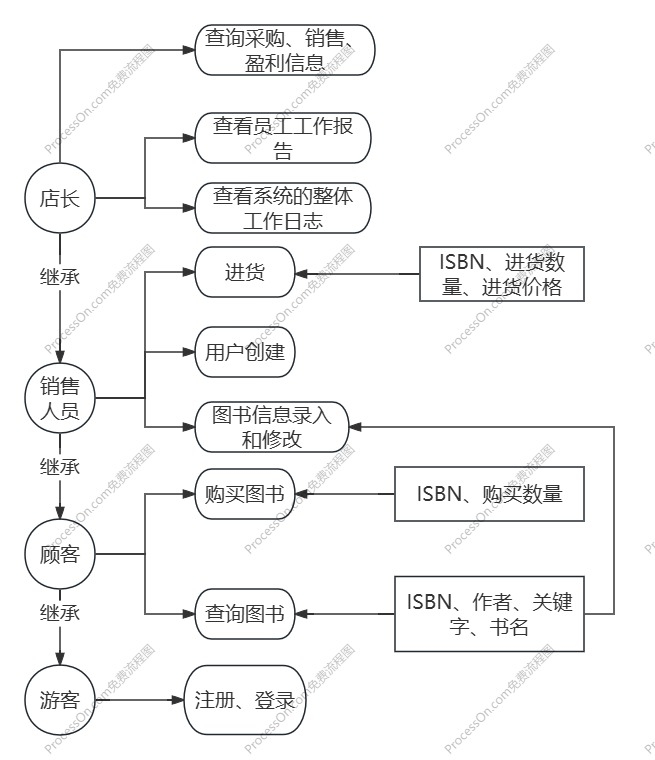
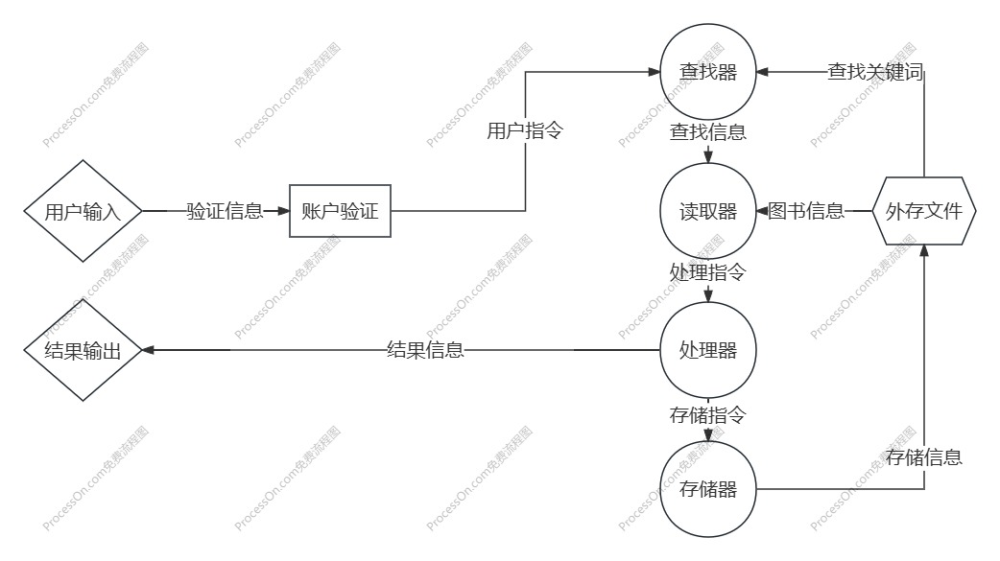

### 项目介绍

设计一个图书管理系统，面向游客、顾客、销售人员和店长四类用户。

### 业务流图



### 数据流图



### 数据词典

- 验证信息：账户、密码等。
- 用户指令：包括指令类型和指令内容。
- 查找关键字：可能为ISBN、作者、书名、关键字等等。
- 查找信息：找到的图书对应的存储位置。
- 图书信息：包括完整的ISBN、作者、书名、关键字、价格等信息。
- 处理指令：包括指令类型和指令内容。
- 存储指令：包括指令类型和指令内容。
- 存储信息：包括存储位置、存储内容等。
- 结果信息：即输出在屏幕上的信息。

### 功能说明

- 验证模块：输入：账户密码；输出：验证信息（成功与否）；操作：进行账户和密码的配对检验。
- 查找模块：输入：查找的关键字；输出：查到的图书文件信息；操作：在外存中进行图书的查询。
- 读取模块：输入：读取位置；输出：读取结果；操作：从外存书库中读取信息。
- 处理模块：输入：指令；输出：存储指令和结果信息；操作：指向用户指令，进行数据更新和结果输出。
- 存储模块：输入：存储位置、存储内容；输出：无；操作：向外存存放信息。
- 输出模块：输入：输出的内容；输出：无；操作：将输入内容打印在屏幕上。

### 用户交互设计

- 用户注册：```register username password```

  输出结果：```succeed/fail```

- 用户登录：```login username password```

  输出结果：```succeed/fail```

- 查询图书：```query ISBN=ALL/given author=ALL/given keyword=ALL/given1,given2,... name=ALL/given```

  输出结果：```find ISBN=... author=... keyword=... name=... storage=... price=.../not find```

- 购买图书：```buy ISBN count```

  输出结果：```price:.../not find```

- 图书信息录入：```new ISBN author keyword name storage price```

  输出结果：```succeed/fail```

- 图书信息修改：```update ISBN=unchanged/given author=unchanged/given keyword=unchanged/given1,given2,... name=unchanged/given storage=unchanged/given price=unchanged/given```

  输出结果：```succeed/fail```

- 进货：```restock ISBN price count```

  输出结果：```now storage:.../fail```

- 创建账户：```create username password```

  输出结果：```succeed/fail```

- 查询采购信息：```query_purchasing_information left_time right_time```

  输出结果：```ISBN-1 price-1 count-1\\ISBN-2 price-2 count-2\\...```

- 查询销售情况：```query_marketing_information left_time right_time```

  输出结果：```ISBN-1 price-1 count-1\\ISBN-2 price-2 count-2\\...```

- 查询盈利信息：```query_earnings_information left_time right_time```

  输出结果：```earnings:... expenses:... profit:...```

- 查看员工工作报告：```query_employee_information account left_time right_time```
  输出结果：```operation-1 object-1\\operation-2 object-2\\...```

- 查看系统整体工作日志：```query_system_information left_time right_time```

  输出结果：```journal-1\\journal-2\\...```
