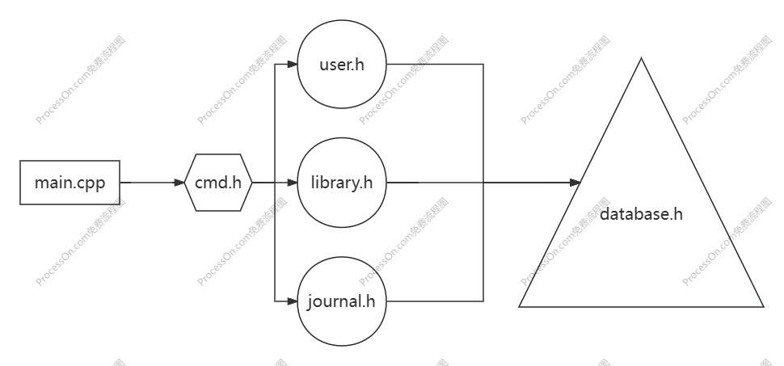

## Bookstore

​													                                                                          -- by ljy

#### 程序功能概述

实现一个用 C++ 语言编写的书店管理系统，采用命令行输入输出，面向顾客、销售人员和店长三类人员，用于向店家和顾客提供图书检索与购买相关服务。

#### 主体逻辑说明

代码的主体逻辑为：输入操作，识别操作，权限验证，执行操作（若失败，返回第一步），文件更新，输出结果。

#### 代码文件结构

**代码文件**

- database.h - 实现了一个key-value 的数据库。
- user.h - 实现了用户类、登录栈以及用户操作。
- library.h - 实现了图书类以及图书操作。
- journal.h - 实现了日志存储与查找操作。
- cmd.h - 实现了控制台以及操作分流。
- main.cpp - 主程序，调用控制台。

**代码结构**

#### 功能设计

- 用户模块

  实现方式：通过数据库实现用户信息的获取、验证、创建和删除；通过登录栈实现嵌套登录，同时在栈内存储当前用户的选中书目。

- 图书模块

  实现方式：通过数据库实现图书的查找、新增和修改。

- 日志模块

  实现方式：通过数据库保存并且读取日志。

#### 数据库设计

主要形式为由BPlusTree构建的key-value数据库。

存储的数据：

- UserID-用户信息（Password, Privilege），使用文件数 2
- ISBN-内部编号，使用文件数 1
- BookName-内部编号，使用文件数 1
- author-内部编号，使用文件数 1
- keyword-内部编号，使用文件数 1
- 内部编号-书籍信息（ISBN, BookName, author, keyword, price, storage），此处实现方式为顺序表，使用文件数 1
- 财务日志信息，此处实现方式为顺序表，使用文件数 1
- 员工工作情况表，此处实现方式为顺序表，使用文件数 1
- 系统操作日志，此处实现方式为顺序表，使用文件数 1

总文件使用数：10

#### 类、结构体设计

**MemoryRiver**

专门为BPlusTree设计的文件读写类，用于存储BPlusTree的结点信息。

**DataRiver**

专门为BPlusTree设计的文件读写类，用于存储BPlusTree叶子指向的数据信息。

**Book**

图书类，存储 ISBN, BookName, author, keyword, price, storage。

**User**

用户类，存储 Password，Privilege。

#### 其他补充说明

bonus 说明：预计实现的 bonus 为 B+树的缓存和并发。